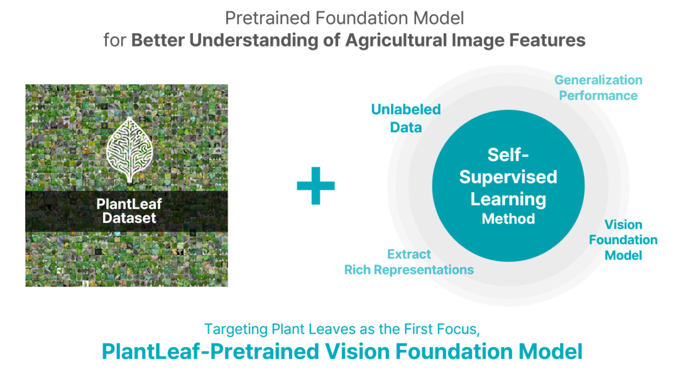

# PlantLeaf Pretrained Model
By Yunseok Han, Woosang Jeon, Sanghyeok Choi, Kyuseok Yang, Taehyeong Kim*

> Code will be available.

## Introduction
The agricultural sector still experiences a notable gap in foundational research on models tailored for its unique needs, particularly in addressing the diverse and complex challenges of data variability and environmental conditions inherent to agricultural applications. 
To bridge this gap, this study introduces **a deep learning-based vision foundation model for agriculture, specifically pretrained on extensive unlabeled plant leaf datasets using self-supervised learning methods like BYOL.**

<p align="center">
  
</p>


## Results ( with ResNet-50 )
| Method                       |          PVD          |     Pepper_chilli     |         Tomato        |        Lettuce        |
|------------------------------|:---------------------:|:---------------------:|:---------------------:|:---------------------:|
| Linear Evaluation :          |                       |                       |                       |                       |
| PlantLeaf Pretrained (Ours ) | **0.922 $\pm$ 0.001** |   0.826 $\pm$ 0.005   | **0.912 $\pm$ 0.002** | **0.625 $\pm$ 0.001** |
| ImageNet Pretrained          |   0.901 $\pm$ 0.002   | **0.854 $\pm$ 0.014** |   0.879 $\pm$ 0.011   |   0.521 $\pm$ 0.080   |
| Fine-tuned :                 |                       |                       |                       |                       |
| PlantLeaf Pretrained (Ours ) | **0.961 $\pm$ 0.003** | **0.939 $\pm$ 0.024** | **0.954 $\pm$ 0.013** | **0.848 $\pm$ 0.013** |
| ImageNet Pretrained          |   0.833 $\pm$ 0.008   |   0.729 $\pm$ 0.038   |   0.810 $\pm$ 0.018   |   0.356 $\pm$ 0.070   |
| Random init                  |   0.833 $\pm$ 0.008   |   0.833 $\pm$ 0.008   |   0.833 $\pm$ 0.008   |   0.833 $\pm$ 0.008   |


## Example Usage with Weight Initialization
```python
import torch
import torch.nn as nn
import torchvision.models as models

model = models.resnet50(weights=None)
in_features = model.fc.in_features
cls_num = 3

# load pretrained model
plantleaf_pretrained = torch.load('./models/byol/resnet/plantleaf_byol_resnet50.pth')
model.load_state_dict(plantleaf_pretrained)

# fc layer weight initialization
weights_dist = {}
for name, layer in model.named_modules():
    if hasattr(layer, 'weight') and isinstance(layer.weight, torch.nn.parameter.Parameter):
        weights_dist[name] = (layer.weight.data.mean().item(), layer.weight.data.std().item())

last_layer_name = list(weights_dist.keys())[-1]
mean, std = weights_dist[last_layer_name]

model.fc = nn.Linear(in_features, cls_num)
model.fc.weight.data.normal_(mean, std)
model.fc.bias.data.zero_()
```

## Models
<table class="tg"><thead>
  <tr>
    <th class="tg-9wq8">SSL Method</th>
    <th class="tg-9wq8">Model</th>
    <th class="tg-9wq8">Available</th>
  </tr></thead>
<tbody>
  <tr>
    <td class="tg-9wq8" rowspan="3">BYOL</td>
    <td class="tg-9wq8">ResNet-18</td>
    <td class="tg-9wq8">✅</td>
  </tr>
  <tr>
    <td class="tg-nrix">ResNet-50</td>
    <td class="tg-nrix">✅</td>
  </tr>
  <tr>
    <td class="tg-nrix">ViTs</td>
    <td class="tg-nrix">Coming Soon</td>
  </tr>
  <tr>
    <td class="tg-9wq8" rowspan="2">DINO</td>
    <td class="tg-9wq8">CNNs</td>
    <td class="tg-9wq8">Coming Soon</td>
  </tr>
  <tr>
    <td class="tg-nrix">ViTs</td>
    <td class="tg-nrix">Coming Soon</td>
  </tr>
</tbody>
</table>


## Citing
If you find this code useful in your research, please consider citing:

    @misc{han2024plantleaf,
    title={Agricultural Vision Foundation Model through Self-Supervised Learning on Plant Leaf Images},
    author={Yunseok Han, Woosang Jeon, Sanghyeok Choi, Kyuseok Yang, Taehyeong Kim},
    howpublished={Presented at CIGR Conference},
    year={2024},
    note={Oral Presentation}
    }

